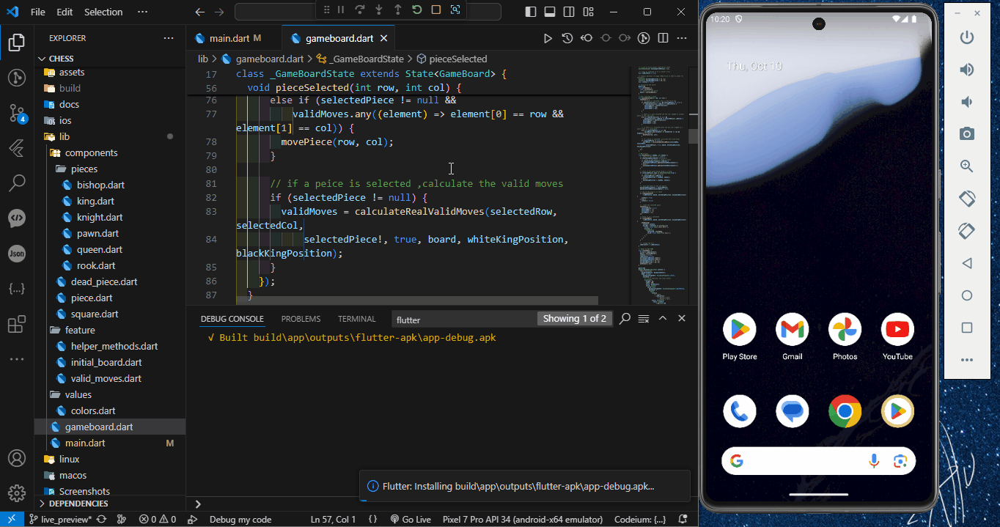

<div align="center" id="top">
  

  <br/>

  <a href="https://twitter.com/intent/follow?screen_name=Harshit2756">
    
  </a>
  <a href="https://www.linkedin.com/in/harshit-khandelwal-3a76631b9/">
    
  </a>
</div>

<h1 align="center">🎮 Chess Game (Flutter)</h1>

<p align="center">
  
  
  
  
</p>

---

## 📜 Table of Contents

- [📖 About](#book-about)
- [👀 See it in Action](#eyes-see-it-in-action)
- [📷 Screenshots](#camera-screenshots)
- [✨ Features](#sparkles-features)
- [✅ Installation](#white_check_mark-installation)
- [🚀 Resources](#rocket-resources)
- [👨‍💻 Author](https://github.com/Harshit2756)

---

## :book: About

**Chess Game** is a fully functional and visually appealing chess game built with Flutter. Play chess with another person in multiplayer mode and enjoy the seamless cross-platform experience on Android and iOS. The app offers a rich feature set with complete chess rules, move validation, and responsive design for a smooth gaming experience on any device.

---

## :eyes: See it in Action

| [](https://harshit2756.github.io/flutter_chess/) | [](https://github.com/Harshit2756/flutter_chess/releases/download/v1.0.0/Chess_game_v1.0.0.apk) | [](https://github.com/Harshit2756/flutter_chess/archive/refs/tags/v1.0.0.zip) |
| :----------------------------------------------------------------------------------------------------------------------------------------------------------: | :---------------------------------------------------------------------------------------------------------------------------------------------------------------------------------------------------------: | :-------------------------------------------------------------------------------------------------------------------------------------------------------------------------------------: |
|                                               [**Live Preview**](https://harshit2756.github.io/flutter_chess/)                                               |                                               [**Download APK**](https://github.com/Harshit2756/flutter_chess/releases/download/v1.0.0/Chess_game_v1.0.0.apk)                                               |                                              [**Source Code**](https://github.com/Harshit2756/flutter_chess/archive/refs/tags/v1.0.0.zip)                                               |

---

## 📺 Demo Video



## :camera: Screenshots

<table width="100%">
  <tbody>
    <tr>
      <td align="center"></td>
      <td align="center"></td>
      <td align="center"></td>
    </tr>
    <tr>
      <td align="center"><b>In-Game</b></td>
      <td align="center"><b>Game Board</b></td>
      <td align="center"><b>Move List</b></td>
    </tr>
  </tbody>
</table>

---

## :sparkles: Features

✔️ **Multiplayer Mode**: Play locally with another player on the same device.\
♟️ **Move Validation**: Follows all official chess rules and validates every move.\
🏁 **Game End Detection**: Automatically detects checkmate, stalemate, and draw conditions.\
🔄 **Turn-Based Gameplay**: Alternates between black and white players seamlessly.\
📱 **Responsive Design**: Adaptable layout for different screen sizes, including mobile and tablet.

## :white_check_mark: Installation

To run this project locally, ensure Flutter is installed. You can follow the official guide [here](https://flutter.dev/docs/get-started/install).

**Requirements**:

- Flutter version `3.22.0`

### Steps to Install:

1. **Clone the repository**:

   ```bash
   git clone https://github.com/Harshit2756/flutter_chess.git
   ```

2. **Navigate to the project directory**:

   ```bash
   cd flutter_chess
   ```

3. **Install the dependencies**:

   ```bash
   flutter pub get
   ```

4. **Run the app**:

   ```bash
   flutter run
   ```

---

## :rocket: Resources

The following resources were used to build this project:

- [Flutter Official Docs](https://flutter.dev/docs)
- [Flutter Community Medium](https://medium.com/flutter-community)
- [Stack Overflow - Flutter](https://stackoverflow.com/questions/tagged/flutter)
- [Icons by Flaticon](https://www.flaticon.com/)

---

## 👨‍💻 Author

**Harshit Khandelwal**

- 🐦 [Twitter](https://twitter.com/Harshit2756)
- 💼 [LinkedIn](https://www.linkedin.com/in/harshit-khandelwal-3a76631b9/)
